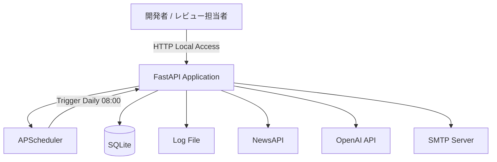
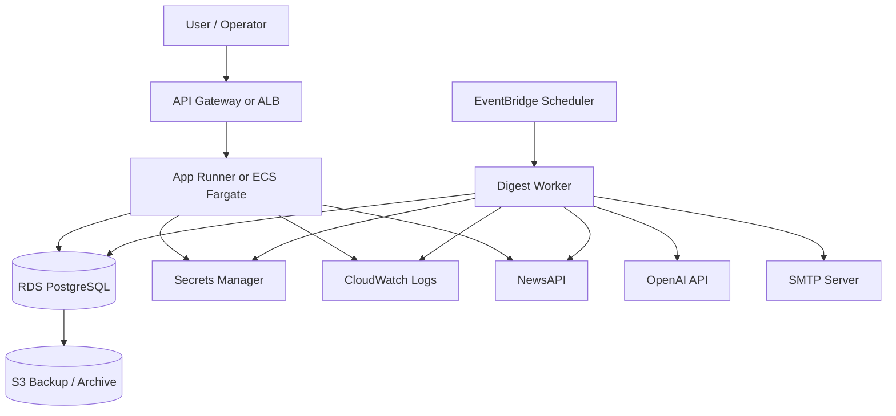

# アーキテクチャ設計書

## 0. 前提整理
### 0-1. 基本設計書から読み取れた情報
| 項目 | 内容 |
|------|------|
| システム名 | FocusDigest |
| 目的 | ユーザーが指定した分野のニュースを日次で収集し、AIで日本語要約してメール配信する |
| 対象ユーザー | 開発者本人、ポートフォリオ閲覧者、レビュー担当者 |
| 主な機能 | ニュース取得、記事保存、記事選定、AI要約、メール送信、定期実行、手動実行API、ヘルスチェックAPI |
| 想定利用規模 | 基本設計書に明示なし。MVPでは単一利用者、低頻度バッチ、同時多重なしの前提で扱う |

### 0-2. 合理的仮定
| 項目 | 仮定内容 | 仮定理由 |
|------|----------|----------|
| 利用規模 | 個人利用またはレビュー用途の小規模利用とする | 基本設計書で個人開発MVP、単一配信先、日次1回実行が示されているため |
| 実行形態 | アプリはローカルPCまたはDocker上で単一プロセス起動とする | FastAPI、APScheduler、SQLiteを同一アプリで扱う前提があるため |
| データ量 | 1回20件取得、配信対象5件、日次蓄積でもSQLiteで十分扱える量とする | MVPでの件数上限が明示されているため |
| 運用者 | 開発者本人が設定、起動、ログ確認を行う | 管理画面、運用監視高度化が対象外のため |
| 将来拡張 | 将来の本番運用時はAWS系マネージドサービスへ置換可能な構成を目指す | クラウド本番運用は対象外だが、将来拡張方針の整理が求められているため |

### 0-3. 要確認事項（先出し）
| 項目 | 確認が必要な理由 | 設計への影響 |
|------|------------------|--------------|
| 1記事の複数回配信履歴 | 将来必要になった場合にテーブル追加が要る | DB設計、移行方針、API拡張に影響する |
| 将来公開時の認証方式 | 外部公開時に認証方式が必要になる | API公開方式、セキュリティ、運用監視に影響する |
| 将来の外部公開範囲 | 内部利用のままか、将来一般公開するかで認証とネットワーク設計が変わる | API公開方式、認証、WAF、運用監視に影響する |
| 目標SLA/SLO | 可用性目標が未定 | 冗長化、監視、通知、復旧設計に影響する |
| RTO/RPO | 障害復旧要求が未定 | バックアップ粒度、DB移行方針、運用手順に影響する |

## 1. システム概要
- システム名: FocusDigest
- 目的: ユーザーが指定した分野のニュースを自動収集し、AIで主要情報を短時間で確認できるメールダイジェストとして配信する
- 対象ユーザー: 開発者本人、レビュー担当者、ポートフォリオ閲覧者
- 想定利用規模: 日次1回実行、単一配信先、低トラフィック、同時実行なしを前提とする
- 業務上の重要ポイント:
  - 外部API連携、AI要約、メール送信を一連で成立させること
  - 面接やレビューで構成意図を説明できること
  - MVP段階では完成可能性を優先し、構成を単純に保つこと

## 2. アーキテクチャ方針
| 項目 | 方針 | 判断理由 |
|------|------|----------|
| 構成思想 | 単一アプリケーション、単一プロセス、同期処理を採用する | MVPで実装難易度を抑え、責務を追いやすくするため |
| 可用性 | 高可用性は追わず、再現性と日次実行の成立を優先する | ローカルまたはDocker実行が前提で、常時稼働保証が要件外のため |
| 拡張性 | 現在は単純構成とし、将来はDB、スケジューラ、実行基盤を置換可能な分離を維持する | MVPでは過剰構成を避けつつ、後続でクラウド移行できるようにするため |
| 保守性 | API層、サービス層、Repository層、外部連携Client層を分ける | 取得、保存、要約、送信の責務を分離し、障害箇所を切り分けやすくするため |
| セキュリティ | 外部公開しない前提で、秘密情報は環境変数管理とし、ログへ出さない | 認証未実装でもローカル限定ならリスクを抑えられるため |
| コスト最適化 | ローカル実行とDocker中心で初期コストを最小化する | 個人開発MVPであり、外部インフラ費用より完成を優先するため |
| 開発効率 | Python、FastAPI、SQLite、APSchedulerに統一する | 学習コストが低く、1人で実装しやすく、説明もしやすいため |

## 3. 全体システム構成
### 3-1. MVP現行構成

### 3-2. MVP現行構成の説明
- 利用者向けフロントエンドは持たない
- FastAPIアプリが手動実行API、ヘルスチェックAPI、日次ジョブの起点をまとめて持つ
- APSchedulerは同一プロセス内でジョブ起動のみを担当する
- SQLiteは記事、要約、実行履歴を永続化する
- ログは `logs/app.log` へのファイル出力を基本とし、直近実行結果はAPIでも確認する
- Docker利用時は `./data:/app/data` と `./logs:/app/logs` をホストマウントする
- NewsAPI、OpenAI API、SMTPが唯一の外部依存である

### 3-3. 将来AWS参照構成
以下は参考構成であり、現時点の採用確定事項ではない。

### 3-4. 将来構成の位置づけ
- FastAPI本体は将来もAPI層として継続利用できる
- APSchedulerは外部スケジューラへ置換する
- SQLiteはRDS PostgreSQLへ置換する
- ログ確認中心の運用はCloudWatch Logs中心へ置換する
- 秘密情報管理は `.env` からSecrets Managerへ移行する

## 4. 技術スタック提案
### 4-1. 現在の推奨スタック
| レイヤ | 採用技術 | 採用理由 | 今採らないもの |
|------|----------|----------|----------------|
| フロントエンド | なし | MVPでは画面を持たず、バッチ処理とAPI確認に集中するため | ReactやNext.jsは価値より工数増加が大きいため |
| バックエンド | Python 3.x + FastAPI | API確認用途と将来拡張の土台を同時に満たせるため | Flaskは将来の型ベースAPI設計で優位性が薄いため |
| スケジューラ | APScheduler | Python内で完結し、単一アプリで扱いやすいため | cronはOS依存が増え、アプリ内説明がしにくいため |
| DB | SQLite | セットアップ不要でMVP規模に十分なため | PostgreSQLは運用準備が先行し、MVPでは過剰なため |
| メール送信 | SMTP | 外部サービス依存を最小限にし、メール送信の仕組みを説明しやすいため | SendGrid APIは追加契約と実装分岐が増えるため |
| 実行環境 | Docker | ローカル差異を抑え、レビュー時の再現性を高めるため | 直接ローカル実行のみでは環境差異が残るため |
| 監視 | ファイルログ + 実行履歴API | MVPに必要な最低限の可観測性を満たすため | DatadogやCloudWatchはローカル前提では過剰なため |

### 4-2. 将来AWS参照スタック
| レイヤ | 参考技術 | 採用候補理由 | 現時点で採用しない理由 |
|------|----------|--------------|------------------------|
| API実行基盤 | ECS Fargate または App Runner | コンテナ実行との親和性が高く、FastAPIを移しやすいため | MVPでは常時稼働サーバーが不要なため |
| スケジューラ | EventBridge Scheduler | 定時実行をマネージドで扱えるため | 現在はAPSchedulerで十分なため |
| ワーカー | ECSタスク | バッチ処理をAPIプロセスから分離しやすいため | 単一アプリ構成を崩す必要がないため |
| DB | RDS PostgreSQL | 同時接続、可用性、バックアップ、拡張に有利なため | SQLiteで現在の件数と頻度を十分処理できるため |
| シークレット管理 | Secrets Manager | APIキーやSMTP資格情報を安全に集中管理できるため | ローカル開発では環境変数で十分なため |
| ログ監視 | CloudWatch Logs | アプリ、バッチ、障害確認を集約できるため | MVPでは外部監視基盤が不要なため |
| バックアップ | S3 + RDS自動バックアップ | 長期保全と障害復旧に有効なため | RTO/RPO未定で、ローカル段階では過剰なため |

## 5. データフロー設計
### 5-1. 定期実行フロー
1. FastAPI起動時にAPSchedulerへ日次08:00ジョブを登録する
2. 指定時刻にAPSchedulerがダイジェスト処理を起動する
3. 実行履歴を `digest_runs` に開始状態で登録する
4. ニュース取得、保存、選定、要約、メール送信を順に実行する
5. 実行結果を `digest_runs` に反映する
6. 処理開始、終了、件数、失敗内容をログへ出力する

判断理由:
- 実行順序を直列に固定することで障害箇所を追いやすくする
- 1日1回実行のため非同期キューは導入しない

### 5-2. 手動実行フロー
1. 開発者がローカルから `POST /jobs/digest/run` を呼ぶ
2. APIがダイジェスト処理を起動する
3. APIレスポンスで実行件数と送信結果を返す
4. 必要に応じて `GET /jobs/digest/runs/latest` で直近結果を確認する

判断理由:
- 手動再実行を持つことで、定期実行の補助とレビュー時のデモを両立できる

### 5-3. ニュース取得から保存まで
1. NewsAPIへユーザー指定分野、上限20件でリクエストする
2. レスポンスからタイトル、説明文、URL、公開日時、配信元を抽出する
3. URLを一意キーとして `articles` に保存する
4. 既存URLは重複登録しない

判断理由:
- URL重複防止で再実行時の二重登録を抑えられる
- 本文スクレイピングを外すことで失敗要因を減らせる

### 5-4. 要約フローと失敗時分岐
1. 保存済み記事から公開日時順に最大5件を選ぶ
2. 各記事のタイトルと説明文をOpenAI APIへ送る
3. 要約成功時は `summary` と `summary_status=success` を保存する
4. 記事単位で失敗した場合は `summary_status=failed` を保存し、他記事は継続する
5. 全件失敗した場合はメール送信を行わず `email_status=skipped` とする

判断理由:
- 外部AI API障害を記事単位に閉じ込めることで全体失敗を減らせる

### 5-5. メール送信フローと失敗記録
1. 要約成功記事が1件以上ある場合のみ本文を生成する
2. SMTPへ接続し、固定送信先へプレーンテキストメールを送る
3. 成功時は `digest_runs.email_status=success` を更新する
4. 失敗時は `digest_runs.email_status=failed` と `error_message` を更新する

判断理由:
- 送信失敗時も要約結果は残すため、原因調査と再送判断がしやすい

### 5-6. 将来拡張時の差し替え点
| 現在 | 将来候補 | 差し替え理由 |
|------|----------|--------------|
| APScheduler | EventBridge Scheduler | アプリ常駐前提を外すため |
| SQLite | RDS PostgreSQL | 同時接続、バックアップ、運用性を高めるため |
| ローカルファイルログ | CloudWatch Logs | 複数実行基盤のログを集約するため |
| `.env` | Secrets Manager | 秘密情報管理を強化するため |
| 単一アプリ内バッチ | API + Worker分離 | 処理分離とスケールアウトを可能にするため |

## 6. 非機能要件対応
### 6-1. 性能
- 対応方針:
  - 1日1回実行を前提とし、20件取得、5件要約、1通送信を数分以内で完了させる
  - 件数上限を固定し、OpenAI APIの呼び出し量を制御する
- 判断理由:
  - 処理量が小さいため、複雑なキャッシュや分散処理を入れる必要がない

### 6-2. 可用性
- 対応方針:
  - 常時稼働保証は行わない
  - PC停止中やコンテナ停止中の未実行ジョブは自動補填しない
  - 手動実行APIで再実行を補完する
- 判断理由:
  - MVPで高可用性を追うと完成率が下がるため

### 6-3. 保守性
- 対応方針:
  - API、Service、Repository、Client、Schedulerに責務を分ける
  - 取得、保存、選定、要約、送信を独立した処理単位で実装する
- 判断理由:
  - 障害切り分けと将来の差し替えを容易にするため

### 6-4. 監視・障害対応
- 対応方針:
  - MVPではファイルログと直近実行結果APIを監視手段とする
  - エラー発生時は処理名、発生時刻、例外内容をログへ残す
- 判断理由:
  - 外部監視基盤がなくても最低限の調査性を確保できるため

### 6-5. バックアップ
- 対応方針:
  - MVPではSQLiteファイル退避を想定する
  - ログファイルは必要期間だけ保管し、長期保管は対象外とする
  - 将来はRDS自動バックアップとS3アーカイブを候補とする
- 判断理由:
  - RTO/RPO未定のため、現時点では簡易保全に留めるべきため

### 6-6. CI/CD
- 対応方針:
  - MVPでは必須構成に含めない
  - 将来はGitHub Actions相当でテスト、イメージビルド、デプロイ自動化を検討する
- 判断理由:
  - 現段階ではアプリ完成が優先であり、運用自動化は後続でも間に合うため

## 7. スケーリング戦略
### 7-1. MVP時点
- 単一プロセス、単一インスタンスで運用する
- SQLiteのローカル永続化で十分とする
- 外部API呼び出し数は取得20件、要約5件に固定する

### 7-2. スケールが必要になる条件
- 配信先が複数になる
- カテゴリ数が増える
- 実行頻度が日次1回を超える
- APIを外部公開する
- 同時実行や高い可用性が必要になる

### 7-3. 段階的な拡張方針
1. SQLiteをPostgreSQLへ置換する
2. バッチ処理をWorkerとして分離する
3. スケジューラを外部マネージドサービスへ移す
4. ログとシークレット管理をマネージド化する
5. API公開時に認証とネットワーク防御を追加する

判断理由:
- 今は完成可能性を優先し、負荷条件が明確になった段階で拡張する方が合理的なため

## 8. セキュリティ設計
- 秘密情報:
  - NewsAPIキー、OpenAI APIキー、SMTP資格情報、送信先アドレスは環境変数で管理する
  - `.env` を使う場合はGit管理対象外とする
- 通信:
  - NewsAPI、OpenAI API、SMTPの通信は各サービスの標準的なTLS接続を前提とする
- API公開範囲:
  - MVPではローカル利用に限定し、外部ネットワークへ公開しない
- ログ管理:
  - APIキー、SMTPパスワード、要約プロンプト全文、認証情報をログへ出力しない
- 将来公開時の追加ポイント:
  - API認証
  - HTTPS終端
  - IP制限またはWAF
  - レート制限

判断理由:
- 認証なしでもローカル限定であればリスクは低いが、外部公開時は設計の前提が変わるため、追加ポイントを明示しておく必要がある

## 9. 運用保守設計
### 9-1. 日常運用
- 開発者がアプリ起動状態を確認する
- 毎日08:00の実行結果をログまたは直近実行結果APIで確認する
- 失敗時は `error_message` とログを確認して原因を特定する

### 9-2. 障害対応
- NewsAPI失敗時:
  - APIキー、通信状態、レスポンス形式を確認する
- OpenAI API失敗時:
  - 該当記事だけ失敗として扱い、全件失敗時のみ送信中止とする
- SMTP失敗時:
  - 接続設定、認証情報、送信元制限を確認する
- SQLite障害時:
  - DBファイルの存在、権限、破損有無を確認する

### 9-3. 保守方針
- モジュール責務に従って改修範囲を限定する
- 外部API仕様変更に備えてClient層を差し替え可能に保つ
- DBスキーマはMVPでは単純に保ち、複雑な移行管理は導入しない

### 9-4. 将来の運用高度化
- CloudWatch Logs等による集中ログ管理
- RDS自動バックアップ
- GitHub Actions等によるCI/CD
- メトリクス通知と異常検知

判断理由:
- MVPでは人手運用で足りるが、将来本番化するなら標準的な運用自動化が必要になるため

## 10. リスク・懸念点
### 10-1. 現行リスク
| 項目 | 内容 | 対応方針 |
|------|------|----------|
| NewsAPI依存 | 取得件数制限やレスポンス変更で取得失敗の可能性がある | 取得処理を分離し、ログで失敗要因を追えるようにする |
| OpenAI API失敗 | 要約API失敗でメール本文が作れない可能性がある | 記事単位失敗を許容し、全件失敗時だけ送信を止める |
| SMTP設定不備 | 送信失敗や認証失敗が発生する可能性がある | 起動前設定確認と送信失敗ログで切り分ける |
| ローカル停止 | PC停止中にジョブが実行されない | 手動実行で補完し、常時運用は対象外とする |
| 認証なしAPI | 外部公開すると不正実行のリスクがある | 外部公開しない前提を厳守する |

### 10-2. 移行リスク
| 項目 | 内容 | 対応方針 |
|------|------|----------|
| SQLite依存 | 将来の同時アクセスや運用性に限界がある | DBアクセスをRepositoryへ閉じ、将来RDSへ移行しやすくする |
| APScheduler依存 | 常時起動前提から抜け出せない | ジョブ起動責務を分離し、外部スケジューラへ置換しやすくする |
| 単一アプリ構成 | APIとバッチが同居している | Digest処理を独立サービス化しやすい責務分割を維持する |
| 監視未整備 | 障害検知が手動依存である | 将来の集中監視導入を前提としたログ設計にする |

## 11. 要確認事項
- SLA/SLOを設定するか
- 想定利用者数、将来の同時接続数、トラフィック見込み
- 予算上限
- 個人情報や機微情報を扱う可能性の有無
- 法規制対応要件の有無
- 目標RTO/RPO
- 将来のAPI公開範囲
- 認証基盤の要否
- 1記事の複数回配信履歴の要否

## 12. 推奨構成まとめ
- 現時点の推奨構成は `FastAPI + APScheduler + SQLite + Docker` の単一アプリ構成とする
- 理由は、個人開発MVPとして完成可能性、実装容易性、説明しやすさの3点で最も適しているため
- 外部依存はNewsAPI、OpenAI API、SMTPに限定し、処理の一連性を重視する
- 監視と運用はファイルログと実行履歴確認に絞り、過剰な基盤は入れない
- 将来本番化が必要になった場合は、AWS参照構成として `EventBridge Scheduler + ECS/App Runner + RDS PostgreSQL + Secrets Manager + CloudWatch Logs` へ段階移行する
- その際も、現在の責務分割を保っていれば、起動基盤、DB、スケジューラ、シークレット管理を順に置換できる
