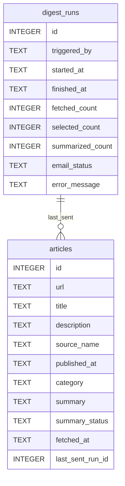

# データベース設計書

## 1. 入力監査結果

### 1-1. 確定事項
- システム名はFocusDigestである
- ユーザーが事前指定した1つの分野に関するニュースを収集対象とする
- 保存先DBはSQLiteである
- 保存対象は取得記事のメタデータ、AI要約結果、バッチ実行単位の実行履歴、メール送信結果である
- 保存しない対象は記事本文、複数配信先管理情報、OpenAI APIの生レスポンス全文、SMTP認証情報である
- `articles` と `digest_runs` が主要テーブルである
- 記事URLは重複防止の一意キーとして扱う
- 要約失敗は記事単位で記録し、全件失敗時はメール送信を中止する
- 手動実行APIと定期実行の両方で同じ実行履歴を管理する
- MVPでは単一アプリケーション、単一プロセス、低頻度実行である

### 1-2. 仮定
- SQLiteのバージョンは `CHECK制約` と `FOREIGN KEY` を利用できる一般的な現行版とする
- 主キーは全テーブルで `INTEGER PRIMARY KEY AUTOINCREMENT` に統一する
- 監査列は `created_at` と `updated_at` を全テーブルで持ち、業務時刻列は別途保持する
- 記事取得時点の分野名は `category` 列へ文字列保存する
- 1記事が複数回配信される可能性はMVPでは管理しない。最後に配信対象となった実行IDのみ `last_sent_run_id` で保持する
- 物理削除は運用作業でのみ実施し、アプリ通常処理では削除しない
- 分野指定値、送信先アドレス、SMTP設定はDBではなく `.env` または環境変数で管理する

### 1-3. 要確認事項
- 将来、1記事の複数回配信履歴を保持する必要があるかどうか
- 分野名は `2文字以上50文字以内`、日本語、英字、数字、半角スペース、`-`、`_` を許可する
- `data/app.db` はDocker利用時に `./data:/app/data` をホストマウントする
- バックアップは日次1回、14世代保持とする
- 将来PostgreSQLへ移行する前提を、正式な運用方針として持つかどうか
- 個人情報や法規制対象データを将来扱う可能性があるかどうか

## 2. システム概要

- システム名: FocusDigest
- 業務目的: ユーザーが指定した分野のニュースを日次で収集し、AI要約とメール配信を成立させる
- 想定ユーザー: 開発者本人、ポートフォリオ閲覧者、レビュー担当者
- 保存対象データ:
  - 取得記事メタデータ
  - 記事ごとの要約結果
  - バッチ実行履歴
  - メール送信成否
- 想定規模:
  - 1回の取得件数は最大20件
  - 1回の要約対象は最大5件
  - 定期実行は1日1回
  - 同時多重実行は想定しない

## 3. DB設計方針

| 項目 | 方針 | 理由 |
|-------|------|------|
| DBMS | SQLiteを採用する | 基本設計で確定しており、MVPの件数、実行頻度、単一プロセス前提に適合するため |
| 正規化 | 第3正規形を基本としつつ、MVPで不要なマスタ分割は行わない | `source_name` や `category` を別テーブル化すると運用コストが増え、業務価値が増えないため |
| 主キー | 全テーブルで `INTEGER PRIMARY KEY AUTOINCREMENT` を採用する | SQLiteで実装が単純で、一貫した参照方式にできるため |
| 削除方針 | アプリ通常処理では削除しない。削除が必要な場合は物理削除する | ソフトデリート列を入れる理由が現時点で存在せず、MVPでは検索条件を複雑化させないため |
| ステータス管理 | 文字列コード + CHECK制約で統一する | `summary_status`、`email_status`、`triggered_by` を可読性高く管理できるため |
| 監査 | 全テーブルに `created_at`、`updated_at` を持ち、業務イベント時刻は別列で保持する | 運用監査と業務上の時刻を分離した方が更新追跡と業務解釈が明確になるため |

## 4. 採用DBMS提案

- 候補:
  - SQLite
  - PostgreSQL
- 推奨:
  - SQLite
- 採用理由:
  - 要件と基本設計でMVPの保存先DBとして明示されている
  - 単一プロセス、低頻度バッチ、少量データに対して十分である
  - セットアップが不要で、学習コストと運用負荷を抑えられる
- 不採用理由:
  - PostgreSQLは将来拡張には有利だが、MVP段階ではサーバー運用、接続設定、移行管理の負荷が増える
  - MySQL系は要件や設計資料に登場せず、採用根拠が不足している

## 5. ER概要図



ER図上の関係は「記事が最後にどの実行で配信対象となったか」を表す参照であり、記事取得元の親子関係ではない。

## 6. テーブル一覧

| テーブル名 | 分類 | 概要 | 想定件数 | 更新頻度 | 備考 |
|-----|--|--|----|----|--|
| articles | 業務データ | 取得記事メタデータと要約結果を保持する | 日次20件増加、年数千件規模 | 取得時、要約時、送信時に更新 | URL重複を防ぐ中核テーブル |
| digest_runs | 履歴データ | バッチ実行単位の処理結果を保持する | 日次1件増加、年数百件規模 | 実行開始時と終了時に更新 | 手動実行と定期実行を同一形式で管理し、メール本文は保存しない |

## 7. テーブル詳細設計

### articles

| カラム名 | 型 | NULL | PK | FK | UNIQUE | DEFAULT | 用途 | 採用理由 |
| ---- | - | ---- | -- | -- | ------ | ------- | -- | ---- |
| id | INTEGER | NO | YES | - | NO | AUTOINCREMENT | 記事識別子 | SQLiteで統一的な主キー戦略を取るため |
| url | TEXT | NO | NO | - | YES | - | 記事URL | 記事重複防止の業務キーであるため |
| title | TEXT | NO | NO | - | NO | - | 記事タイトル | 要約入力と表示の基本情報であるため |
| description | TEXT | YES | NO | - | NO | NULL | 記事説明文 | NewsAPIで取得可能な要約元データであるため |
| source_name | TEXT | YES | NO | - | NO | NULL | 配信元名 | 表示と追跡に必要だが、マスタ化する必要はないため |
| published_at | TEXT | NO | NO | - | NO | - | 記事公開日時 | 記事選定のソート条件であるため |
| category | TEXT | NO | NO | - | NO | - | 取得対象分野 | ユーザー指定分野を記事単位で記録するため |
| summary | TEXT | YES | NO | - | NO | NULL | AI要約結果 | メール本文生成と再確認に必要であるため |
| summary_status | TEXT | NO | NO | - | NO | `'pending'` | 要約処理状態 | 記事単位の正常 / 異常を区別するため |
| fetched_at | TEXT | NO | NO | - | NO | CURRENT_TIMESTAMP | 記事取得日時 | 業務イベント時刻として必要であるため |
| last_sent_run_id | INTEGER | YES | NO | YES | NO | NULL | 最後に配信対象となった実行ID | 記事と実行履歴を最低限結び付けるため |
| created_at | TEXT | NO | NO | - | NO | CURRENT_TIMESTAMP | 作成日時 | 監査列方針を統一するため |
| updated_at | TEXT | NO | NO | - | NO | CURRENT_TIMESTAMP | 更新日時 | 更新追跡に必要であるため |

業務ルール:
- `url` はシステム内で一意とする
- `summary_status` は `pending`、`success`、`failed` のみ許容する
- `summary` は `summary_status='success'` のときに更新対象となる
- `category` はMVPでは単一分野だが、将来複数分野対応時にも使えるよう文字列で保持する

### digest_runs

| カラム名 | 型 | NULL | PK | FK | UNIQUE | DEFAULT | 用途 | 採用理由 |
| ---- | - | ---- | -- | -- | ------ | ------- | -- | ---- |
| id | INTEGER | NO | YES | - | NO | AUTOINCREMENT | 実行履歴識別子 | SQLiteで統一的な主キー戦略を取るため |
| triggered_by | TEXT | NO | NO | - | NO | - | 実行起点 | 手動実行と定期実行を区別するため |
| started_at | TEXT | NO | NO | - | NO | CURRENT_TIMESTAMP | 実行開始日時 | 処理時間計測と監査に必要であるため |
| finished_at | TEXT | YES | NO | - | NO | NULL | 実行終了日時 | 失敗時や実行中状態を表現するため |
| fetched_count | INTEGER | NO | NO | - | NO | 0 | 取得件数 | 外部API取得結果の把握に必要であるため |
| selected_count | INTEGER | NO | NO | - | NO | 0 | 選定件数 | 要約対象件数の把握に必要であるため |
| summarized_count | INTEGER | NO | NO | - | NO | 0 | 要約成功件数 | 要約成功率の把握に必要であるため |
| email_status | TEXT | NO | NO | - | NO | `'skipped'` | メール送信結果 | 送信成否を統一管理するため |
| error_message | TEXT | YES | NO | - | NO | NULL | 主要エラーメッセージ | 失敗原因の一次確認に必要であるため |
| created_at | TEXT | NO | NO | - | NO | CURRENT_TIMESTAMP | 作成日時 | 監査列方針を統一するため |
| updated_at | TEXT | NO | NO | - | NO | CURRENT_TIMESTAMP | 更新日時 | 更新追跡に必要であるため |

業務ルール:
- `triggered_by` は `scheduler` または `manual` のみ許容する
- `email_status` は `success`、`skipped`、`failed` のみ許容する
- 実行開始時に1行作成し、終了時に件数と結果を更新する
- 記事0件または要約成功0件の場合は `email_status='skipped'` を許容する

## 8. リレーション設計

| 親テーブル | 子テーブル | 関係 | 外部キー | ON DELETE | ON UPDATE |
| ----- | ----- | -- | ---- | --------- | --------- |
| digest_runs | articles | 1対多 | articles.last_sent_run_id -> digest_runs.id | SET NULL | NO ACTION |

設計理由:
- `last_sent_run_id` は履歴全件ではなく最終送信実行のみを保持する
- `digest_runs` を削除した場合も記事自体は保持すべきため、`ON DELETE SET NULL` を採用する
- SQLiteでは業務上 `digest_runs` の更新は想定しないため、`ON UPDATE NO ACTION` で十分である

## 9. 性能設計

- 想定最大件数:
  - `articles` は年数千件規模
  - `digest_runs` は年数百件規模
- 想定ボトルネック:
  - URL重複判定
  - 公開日時降順での上位5件取得
  - 直近実行履歴の取得
- インデックス戦略:
  - `articles(url)` にUNIQUEインデックス
  - `articles(category, published_at DESC)` に複合インデックス
  - `articles(last_sent_run_id)` に補助インデックス
  - `digest_runs(started_at DESC)` にインデックス
- キャッシュ方針:
  - MVPではキャッシュを導入しない
  - 件数と実行頻度が小さく、DB読取負荷が問題にならないため

## 10. データ整合性設計

- トランザクション対象:
  - 記事保存の一括INSERTまたはUPSERT処理
  - 実行開始時の `digest_runs` 作成
  - 実行終了時の `digest_runs` 更新
  - 要約結果更新と `summary_status` 更新
- 排他制御方針:
  - MVPは単一プロセス、同時実行なし前提とする
  - DBレベルの複雑な排他制御は導入しない
  - アプリ側でジョブ同時起動を防止する
- 一意制約一覧:
  - `articles.url`
- 重複防止策:
  - DBで `UNIQUE(url)` を持つ
  - アプリ側でも保存前にURL単位の存在確認またはUPSERT相当処理を行う

制約とアプリ側バリデーションの責務分担:
- DB制約で担保するもの
  - 主キー一意性
  - URL重複防止
  - 必須列のNOT NULL
  - ステータス値のCHECK制約
  - 外部キー整合性
- アプリ側で担保するもの
  - URL形式妥当性
  - 日時文字列の妥当性
  - 分野名の妥当性
  - 要約文字数や生成結果空文字の扱い

## 11. セキュリティ設計

- 個人情報:
  - 入力資料上、個人情報をDBへ保存する要件はない
  - 配信先メールアドレスはDBへ保存しない前提とする
- 暗号化対象:
  - DB内の暗号化対象は現時点では明示されていない
  - DBファイル自体の暗号化が必要かは要確認事項とする
- 権限制御:
  - SQLiteファイルはOSのファイル権限で制御する
  - アプリケーション利用者はローカル実行者に限定する
- 監査ログ対象:
  - `digest_runs.error_message`
  - `digest_runs.triggered_by`
  - `articles.summary_status`

設計理由:
- DBに機微な資格情報を持ち込まない方が、MVPの運用と漏えいリスクを単純化できるため

## 12. 運用保守設計

- バックアップ:
  - MVPではSQLiteファイルを単位としてバックアップする
  - 頻度は要確認事項だが、最低でもリリース前と運用変更前の退避を推奨する
- リストア:
  - アプリ停止後にSQLiteファイルを退避版へ置き換える手順を想定する
  - リストア後は `digest_runs` の最新状態確認を行う
- Migration:
  - MVPではSQLite用の手書きDDLを正とし、複雑なマイグレーションツールは導入しない
  - スキーマ変更時はDDL更新とDB再作成、または手動ALTERで対応する
- 監視:
  - DB自体の専用監視は行わない
  - アプリログと `digest_runs` の記録内容で障害確認を行う

## 13. サンプルDDL（主要テーブル）

```sql
PRAGMA foreign_keys = ON;

CREATE TABLE digest_runs (
    id INTEGER PRIMARY KEY AUTOINCREMENT,
    triggered_by TEXT NOT NULL CHECK (triggered_by IN ('scheduler', 'manual')),
    started_at TEXT NOT NULL DEFAULT CURRENT_TIMESTAMP,
    finished_at TEXT NULL,
    fetched_count INTEGER NOT NULL DEFAULT 0,
    selected_count INTEGER NOT NULL DEFAULT 0,
    summarized_count INTEGER NOT NULL DEFAULT 0,
    email_status TEXT NOT NULL DEFAULT 'skipped'
        CHECK (email_status IN ('success', 'skipped', 'failed')),
    error_message TEXT NULL,
    created_at TEXT NOT NULL DEFAULT CURRENT_TIMESTAMP,
    updated_at TEXT NOT NULL DEFAULT CURRENT_TIMESTAMP
);

CREATE TABLE articles (
    id INTEGER PRIMARY KEY AUTOINCREMENT,
    url TEXT NOT NULL UNIQUE,
    title TEXT NOT NULL,
    description TEXT NULL,
    source_name TEXT NULL,
    published_at TEXT NOT NULL,
    category TEXT NOT NULL,
    summary TEXT NULL,
    summary_status TEXT NOT NULL DEFAULT 'pending'
        CHECK (summary_status IN ('pending', 'success', 'failed')),
    fetched_at TEXT NOT NULL DEFAULT CURRENT_TIMESTAMP,
    last_sent_run_id INTEGER NULL,
    created_at TEXT NOT NULL DEFAULT CURRENT_TIMESTAMP,
    updated_at TEXT NOT NULL DEFAULT CURRENT_TIMESTAMP,
    FOREIGN KEY (last_sent_run_id) REFERENCES digest_runs(id)
        ON DELETE SET NULL
        ON UPDATE NO ACTION
);

CREATE INDEX idx_articles_category_published_at
    ON articles (category, published_at DESC);

CREATE INDEX idx_articles_last_sent_run_id
    ON articles (last_sent_run_id);

CREATE INDEX idx_digest_runs_started_at
    ON digest_runs (started_at DESC);
```

## 14. リスク・懸念点

| リスク | 内容 | 対策 |
| --- | -- | -- |
| SQLite単一ファイル依存 | ファイル破損や誤削除時の影響が大きい | DBファイル単位の退避とリストア手順を準備する |
| 配信履歴の保持不足 | `last_sent_run_id` だけでは複数回送信履歴を追えない | 将来必要になった時点で中間テーブル追加を検討する |
| 分野名の自由入力 | 表記ゆれで検索品質や分析性が落ちる | MVPでは設定値を1件に固定し、将来マスタ化を検討する |
| 日時型の文字列保存 | SQLiteの型柔軟性により不正値混入の余地がある | アプリ側でISO8601形式を検証する |
| `updated_at` 自動更新不足 | SQLite標準DDLだけでは更新時自動反映されない | アプリ更新SQLで明示的に `updated_at` を更新する |

## 15. 要確認事項

- 1記事の複数回配信履歴を将来保持する必要があるかどうか
- 分野名ルールをDB制約ではなくアプリ側バリデーションで固定してよいか
- `data/app.db` のバックアップ保持期間を14世代で確定してよいか
- DBファイル暗号化の要否
- PostgreSQL移行をロードマップへ正式に含めるかどうか

## 16. 結論

- 初期リリース推奨構成:
  - DBMSはSQLite
  - テーブルは `articles` と `digest_runs` の2テーブルを中核とする
  - 主キーは `INTEGER PRIMARY KEY AUTOINCREMENT` に統一する
  - ステータスは文字列コード + CHECK制約で統一する
  - 監査列は `created_at` と `updated_at` を統一採用する
- 将来拡張方針:
  - 複数分野対応時は `categories` マスタ追加を検討する
  - 複数配信履歴が必要になった場合は `article_deliveries` のような中間テーブル追加を検討する
  - 高可用性や同時実行が必要になった時点でPostgreSQL移行を検討する
- 実装着手時の優先テーブル:
  1. `digest_runs`
  2. `articles`
  3. インデックスと外部キー制約
