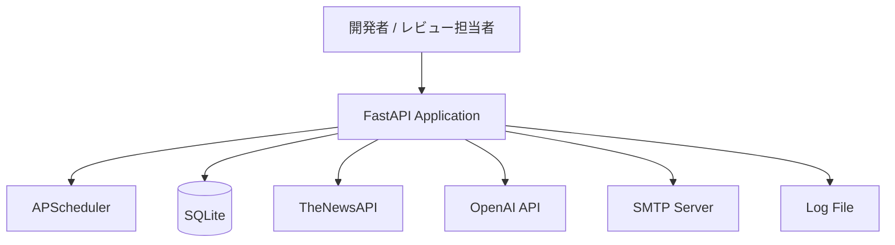

# 技術選定資料

## 1. 入力監査結果

### 1-1. 確定事項

* システム名はFocusDigestである
* MVPの主目的は、指定分野のニュース取得、記事保存、記事選定、AI要約、メール送信、定期実行を一連で成立させることである
* 対象分野はユーザーが事前指定した1件である
* ニュース取得元はTheNewsAPIである
* 要約はOpenAI APIである
* DBはSQLiteである
* メール送信はSMTPである
* 定期実行はAPSchedulerである
* 実行環境はローカルまたはDockerである
* Web UI、認証、複数ユーザー対応、クラウド本番運用、監視基盤、CI/CDはMVP対象外である
* 開発期間の目安は2週間から4週間である
* 開発体制は実質1名を前提としている

### 1-2. 仮定

* 開発は内製前提であり、外注は使わない
* Python中級、Docker初学者、AWS初学者という前提から、学習コストの大きい分散構成は現実的ではない
* ローカル実行またはDocker実行でポートフォリオ検証とデモができれば、MVPの目的は満たせる
* 予算上限は未提示だが、個人開発MVPとして初期費用と月額費用は低い方が望ましい
* 本番相当構成は現時点では実装対象ではなく、将来比較用の参考構成として扱う

### 1-3. 要確認事項

* 予算上限
* 納期の厳格度
* 同時接続数
* レスポンスタイム要件
* 可用性SLA
* セキュリティ基準
* 監査要件
* 個人情報保護要件
* 社内標準技術
* ベンダー契約制約
* システム名は `FocusDigest`

## 2. プロジェクト概要

* システム名: FocusDigest
* 開発目的: 指定分野のニュースを収集し、AI要約してメール配信するMVPを完成させること
* 想定ユーザー: 開発者本人、ポートフォリオ閲覧者、面接官・レビュー担当者
* 開発期間: 2週間から4週間
* チーム体制: 1名開発を前提とする
* 制約条件:
  * 短期間
  * 1名開発
  * 低コスト前提
  * 外部API依存
  * ローカル / Docker前提
  * MVPでは画面、認証、クラウドを扱わない
* 特記事項:
  * 技術選定では流行性より完成可能性を優先する
  * MVP構成と将来拡張構成は分けて評価する

## 3. 技術選定方針

| 項目 | 方針 | 理由 |
|------|--|--|
| 優先事項 | 要件適合性と完成可能性を最優先とする | 1名開発、短納期MVPのため |
| 開発速度 | 学習コストが低く、実装着手が速い技術を採用する | 2週間から4週間の制約があるため |
| 保守性 | 単一アプリでも責務分離できる技術を採用する | 障害切り分けと将来の拡張に必要なため |
| 運用性 | 外部監視なしでも最低限運用できる構成を採用する | ローカル / Docker前提で運用負荷を抑えるため |
| 拡張性 | MVPでは最低限、将来は置換しやすい構成を選ぶ | MVPで過剰設計を避けつつ、後続フェーズに備えるため |
| 採用市場 | Python系の一般的な技術を優先する | 情報量が多く、説明しやすく、外注もしやすいため |
| 学習コスト | 初学者負荷の高い分散基盤は避ける | Docker、SMTP、環境変数管理だけでも学習負荷があるため |
| セキュリティ | 外部公開しない前提で秘密情報を分離管理する | 認証未実装のままでもリスクを抑えるため |
| コスト最適化 | 初期費用ゼロまたは低額で成立する構成を優先する | 予算上限が未確定であり、個人開発MVPのため |

## 4. 全体推奨技術スタック（結論）

| 領域 | 推奨技術 | 評価 | 判定 | 理由 |
| -- | ---- | -- | -- | -- |
| アプリ言語 | Python 3.x | A | 採用 | 既存スキルと要件適合性が高く、外部API連携とバッチ処理に向くため |
| Web / APIフレームワーク | FastAPI | A | 採用 | 手動実行APIとヘルスチェックAPIを軽量に実装でき、将来拡張もしやすいため |
| スケジューラ | APScheduler | A | 採用 | Python内で完結し、cronよりアプリ一体で説明しやすいため |
| データベース | SQLite | A | 採用 | MVP規模に十分で、セットアップ不要、運用負荷が低いため |
| メール送信 | SMTP | B | 採用 | シンプルで追加サービス契約が不要なため |
| コンテナ実行 | Docker | A | 採用 | 再現性を高め、レビュー時の起動を揃えられるため |
| 監視 | ファイルログ + 実行履歴API | B | 採用 | MVPで必要な最低限の可観測性を低コストで満たすため |
| AI要約 | OpenAI API | A | 採用 | 要件で確定しており、AI活用実績として説明しやすいため |
| ニュース取得 | TheNewsAPI | A | 採用 | 無料枠のままでも公開MVPを視野に入れやすく、レスポンスも扱いやすいため |

## 5. 領域別比較検討

### バックエンド言語 / アプリ層

| 候補技術 | メリット | デメリット | 評価 | 判定 | 採用条件 / 不採用理由 |
| ---- | ---- | ----- | -- | -- | ------------ |
| Python + FastAPI | API連携、バッチ処理、Pydanticによる型管理、学習コストの低さ | 高負荷API向けの最適化は別途必要 | A | 採用 | 現スキルと要件に最も適合する |
| Python + Flask | 学習コストが低い、軽量 | 型定義、バリデーション、将来API化の整理でFastAPIに劣る | B | 不採用 | 今回は手動実行APIと将来拡張を考えるとFastAPIの方が整合的 |
| Node.js + Express | 非同期I/Oに強い、求人市場が広い | 現スキル前提と乖離し、短期MVPで学習コストが増える | C | 不採用 | Python採用が事実上確定しているため |
| Java + Spring Boot | エンタープライズ標準として強い | 初期実装量が多く、1名短期MVPには重い | C | 不採用 | 今回は完成可能性より構成が先行してしまうため |

### スケジューラ

| 候補技術 | メリット | デメリット | 評価 | 判定 | 採用条件 / 不採用理由 |
| ---- | ---- | ----- | -- | -- | ------------ |
| APScheduler | Python内で完結、アプリ一体、設定が分かりやすい | アプリ常駐前提になる | A | 採用 | ローカル / Docker前提のMVPに合う |
| cron | OS標準、追加ライブラリ不要 | OS依存が強く、アプリ外に責務が分散する | B | 不採用 | アプリ全体の説明性と再現性が下がるため |
| Celery Beat + Worker | 本番拡張に強い | RedisやWorker追加が必要で過剰設計 | D | 不採用 | 1名開発、短納期MVPに不適合 |
| EventBridge Scheduler | マネージドで安定 | AWS前提になり、MVPスコープ外 | C | 不採用 | 将来構成では候補だが、現時点では対象外 |

### データベース

| 候補技術 | メリット | デメリット | 評価 | 判定 | 採用条件 / 不採用理由 |
| ---- | ---- | ----- | -- | -- | ------------ |
| SQLite | セットアップ不要、低コスト、MVP規模に十分 | 同時接続や運用拡張に限界がある | A | 採用 | 単一プロセス、低頻度実行の条件で成立する |
| PostgreSQL | 拡張性、運用性、並行処理に強い | DB運用コストが増える | B | 不採用 | 将来候補として妥当だが、MVPでは過剰 |
| MySQL | 一般的で実績が多い | 今回の要件との比較優位が弱い | C | 不採用 | PostgreSQLより優先する根拠が入力にない |

### メール送信

| 候補技術 | メリット | デメリット | 評価 | 判定 | 採用条件 / 不採用理由 |
| ---- | ---- | ----- | -- | -- | ------------ |
| SMTP | シンプル、低コスト、導入ハードルが低い | 接続先設定に左右される、送信制限確認が必要 | B | 採用 | 接続先サービスを早期確定する必要がある |
| SendGrid API | API連携しやすい、運用実績がある | 追加サービス契約と実装分岐が増える | C | 不採用 | MVPではSMTPで十分であり、追加コスト要因になる |
| SES | AWS本番で有利 | AWS前提、設定項目が増える | C | 不採用 | MVPでクラウド本番運用をしないため |

### コンテナ / 実行環境

| 候補技術 | メリット | デメリット | 評価 | 判定 | 採用条件 / 不採用理由 |
| ---- | ---- | ----- | -- | -- | ------------ |
| Docker | 再現性、配布容易性、環境差異の抑制 | Docker初学者には初期学習が必要 | A | 採用 | ポートフォリオ再現性の観点で優位 |
| ローカル直実行のみ | 学習負荷が低い | 環境差異が残り、レビュー時再現性が下がる | B | 不採用 | Docker併用の方が説明しやすい |
| Kubernetes | 本番スケールに強い | 構築・運用負荷が高すぎる | D | 不採用 | 案件規模に対して過剰設計 |

### 監視 / ログ

| 候補技術 | メリット | デメリット | 評価 | 判定 | 採用条件 / 不採用理由 |
| ---- | ---- | ----- | -- | -- | ------------ |
| ファイルログ + 実行履歴API | 低コスト、導入が速い、MVPで十分 | 監視通知や集約は弱い | B | 採用 | ローカル / Docker前提のMVPには適合する |
| CloudWatch Logs | 集約しやすい、将来本番向き | AWS前提でMVP対象外 | C | 不採用 | 将来構成向け |
| Datadog | 高機能監視 | コストと導入負荷が高い | D | 不採用 | 予算未確定のMVPでは不適合 |

## 6. 推奨アーキテクチャ構成

### 6-1. 構成理由

* 単一アプリ構成で、取得、保存、要約、送信、手動実行APIを一体管理できる
* 1名開発、短納期、低コストという制約に最も適合する
* 障害箇所をアプリ内で追いやすく、ポートフォリオ説明もしやすい

### 6-2. MVP時点の最小構成

* Python + FastAPI
* APScheduler
* SQLite
* TheNewsAPI
* OpenAI API
* SMTP
* Docker
* ファイルログ + 実行履歴API

### 6-3. 本番運用想定構成

* FastAPIアプリをコンテナ化
* 外部スケジューラで定期実行
* PostgreSQL系RDBMSへ移行
* 集中ログ基盤追加
* 秘密情報管理をシークレット管理サービスへ移行

本番運用想定構成は参考案であり、現時点の実装対象ではない。

### 6-4. 将来拡張案

* 複数分野設定対応
* 複数配信先対応
* Web UI追加
* 認証追加
* クラウド本番運用移行
* SQLiteからPostgreSQLへの移行
* APSchedulerから外部スケジューラへの移行

## 7. 開発体制との相性評価

| 観点 | 評価 | コメント |
| --------- | -- | ---- |
| 現チームスキル適合 | High | Python中級前提と整合し、バックエンド実装に着手しやすい |
| 採用しやすさ | High | FastAPI、SQLite、Dockerは情報量が多く、環境構築しやすい |
| 教育しやすさ | High | 分散基盤を避けているため、学習対象を絞れる |
| 外注しやすさ | Medium | Python系は一般的だが、MVP独自仕様はドキュメント整備が必要 |
| 運用しやすさ | Medium | MVP運用は簡単だが、常時運用や監視には弱い |

## 8. コスト試算（概算）

| 項目 | 初期 | 月額 | 前提 | 備考 |
| -- | -- | -- | -- | -- |
| Python / FastAPI / APScheduler / SQLite | 0円相当 | 0円相当 | OSS利用を前提 | 学習コストは別途発生する |
| Docker | 0円相当 | 0円相当 | Docker Desktop等の利用条件は別途確認 | 商用利用条件は要確認事項 |
| TheNewsAPI | 0円相当から | 変動 | 無料枠利用を前提とする | 無料枠でも公開MVP候補として扱いやすい |
| OpenAI API | 0円ではない可能性が高い | 変動 | 1日1回、要約5件を前提 | 利用量で増減する |
| SMTP | 0円相当から | 変動 | Gmail SMTPを前提とする | Gmailの送信条件で変動する |
| クラウド本番運用 | 0円 | 0円 | MVP対象外 | 後続フェーズで別見積りが必要 |

## 9. リスクと対策

| リスク | 内容 | 影響 | 対策 |
| --- | -- | -- | -- |
| スコープに対して技術を盛り込みすぎる | 分散基盤やクラウドを早期に入れたくなる | 納期遅延、学習負荷増大 | MVP技術を固定し、後続フェーズへ分離する |
| 外部API障害で機能が止まる | TheNewsAPI、OpenAI API、SMTPに依存する | 実行失敗、デモ失敗 | Client層分離、失敗ログ、実行履歴記録で切り分ける |
| Dockerで初期学習負荷がかかる | 開発者がDocker初学者 | 着手遅延 | アプリ構成を単純に保ち、Docker利用は1コンテナに限定する |
| SQLiteの限界を超える | 将来件数や同時実行が増える | 性能・運用制約 | MVPではSQLite、将来はPostgreSQLへ移行する前提を明記する |
| SMTP設定で詰まる | Gmailのアプリパスワード設定でつまずく可能性がある | 送信機能が完成しない | Gmailのアプリパスワード利用手順を先に確定する |

## 10. 不採用候補と理由

| 領域 | 技術 | 理由 |
| -- | -- | -- |
| バックエンド | Spring Boot | 1名短期MVPに対して初期実装負荷が高い |
| バックエンド | Node.js + Express | 現スキル前提と乖離し、学習コストが増える |
| スケジューラ | Celery Beat + Worker | RedisやWorker構成が必要で過剰設計になる |
| スケジューラ | cron | アプリ外へ責務が分散し、再現性が下がる |
| DB | PostgreSQL | 将来候補としては有効だが、MVPでは運用負荷が大きい |
| メール送信 | SendGrid API | 追加サービス依存とコスト要因が増える |
| 実行環境 | Kubernetes | 案件規模と体制に対して明らかに過剰 |
| 監視 | Datadog | コスト前提なしに採用できない |

## 11. 最終結論

* 今回の案件に最適な技術構成
  * Python 3.x
  * FastAPI
  * APScheduler
  * SQLite
  * SMTP
  * Docker
  * TheNewsAPI
  * OpenAI API
  * ファイルログ + 実行履歴API
* 採用理由
  * 要件適合性が高い
  * 制約条件に適合する
  * 1名開発、短納期、低コストで成立する
  * 学習コストと説明コストの両方を抑えられる
* 初期リリースでの推奨範囲
  * ニュース取得
  * 記事保存
  * 記事選定
  * AI要約
  * メール送信
  * 日次実行
  * 手動実行API
  * ログ出力
* 将来のリプレイス / 拡張ロードマップ
  * SQLiteからPostgreSQLへ移行
  * APSchedulerから外部スケジューラへ移行
  * SMTPからAPI型メールサービスへ移行を再評価
  * 監視基盤とシークレット管理を追加
  * Web UI、認証、複数分野対応を追加
* 今回見送る技術と理由
  * 分散ジョブ基盤、Kubernetes、重い監視基盤、クラウド本番構成は、案件規模と体制に対して過剰であるため

## 12. 要確認事項

* 未確定要件
  * 1記事の複数回配信履歴を将来保持する必要性
* 性能要件
  * 同時接続数
  * レスポンスタイム要件
* セキュリティ要件
  * セキュリティ基準
  * 監査要件
  * 個人情報保護要件
* 予算制約
  * 外部API利用の正式予算
  * Docker利用条件
* 社内スキル状況
  * Python以外の標準技術有無
  * 社内標準クラウド有無
* 運用体制
  * 保守窓口
  * 将来公開時の認証方式、HTTPS終端、Rate Limit方針
* SLA / 可用性要件
  * 障害対応SLA
  * 可用性目標
